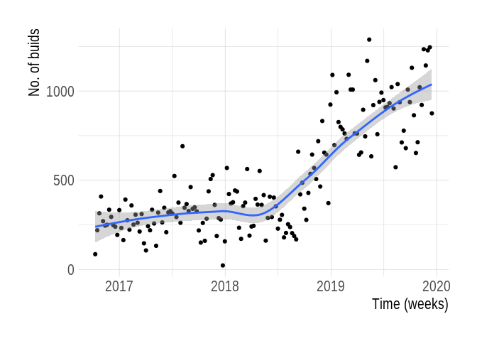
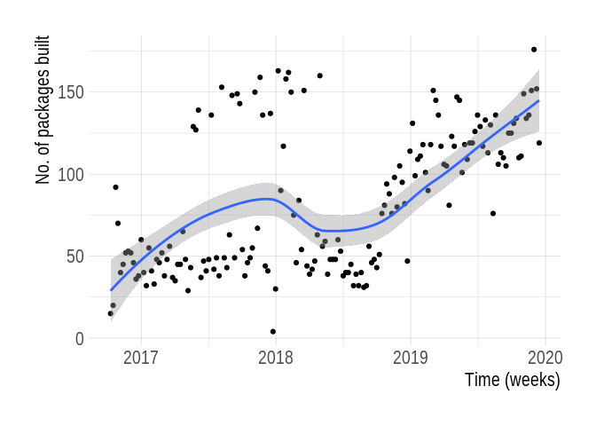

Earlier this year when launching this blog we [explained why R package developers should care about R-hub](/2019/03/26/why-care/). So, does anyone care? :wink: Yes! Let's summarize R-hub usage.

## Usage data

As specified in our [use terms](https://builder.r-hub.io/terms.html) we do not store user data. However we do store some usage data. In the table loaded below, emails and packages are unidentified -- but you can know whether an email or package comes up several times. 


```r
builds <- tibble::as_tibble(readRDS(my_not_portable_path))
builds
```

```
## # A tibble: 84,996 x 8
##    email package platform status submitted           started            
##    <chr> <chr>   <chr>    <chr>  <dttm>              <dttm>             
##  1 9a16… b64e51… windows… error  2018-03-15 07:23:17 NA                 
##  2 9a16… b64e51… macos-e… ok     2018-03-16 05:44:39 2018-03-16 05:44:43
##  3 9a16… b64e51… debian-… ok     2018-03-16 05:48:19 2018-03-16 05:48:24
##  4 9a16… b64e51… windows… ok     2018-03-16 06:03:35 NA                 
##  5 9a16… b64e51… linux-x… ok     2018-03-16 06:05:23 2018-03-16 06:05:28
##  6 9a16… b64e51… ubuntu-… ok     2018-03-16 06:09:44 2018-03-16 06:09:49
##  7 9a16… b64e51… debian-… ok     2018-03-16 06:25:04 2018-03-16 06:25:08
##  8 9a16… b64e51… debian-… ok     2018-03-16 06:36:19 2018-03-16 06:36:24
##  9 9a16… b64e51… debian-… ok     2018-03-16 06:43:25 2018-03-16 06:43:29
## 10 9a16… b64e51… windows… error  2018-03-16 06:57:38 NA                 
## # … with 84,986 more rows, and 2 more variables: build_time <dbl>, ui <chr>
```

## A recent increase in usage

### Towards 1,000 builds a week? 


```r
library("ggplot2")
library("magrittr")
dplyr::mutate(builds, 
             week = as.Date(cut(submitted, "week"))) %>%
  dplyr::count(week) %>%
ggplot(aes(week, n)) +
  geom_point() +
  geom_smooth() +
  ylab("No. of buids") +
  xlab("Time (weeks)") +
  hrbrthemes::theme_ipsum(base_size = 16,
                          axis_title_size = 16)
```

```
## `geom_smooth()` using method = 'loess' and formula 'y ~ x'
```



When plotting the weekly count of builds as below, it is quite clear that usage stepped up at the end of last year. A delayed effect of the [RStudio webinar about R-hub](https://resources.rstudio.com/the-essentials-of-data-science/r-hub-overview-ga-bor-csa-rdi)?

### Number of unique packages built per week


```r
dplyr::mutate(builds, 
             week = as.Date(cut(submitted, "week"))) %>%
  dplyr::group_by(week) %>%
  dplyr::summarise(n = length(unique(package))) %>%
ggplot(aes(week, n)) +
  geom_point() +
  ylab("No. of packages built") +
  xlab("Time (weeks)")  +
  geom_smooth() +
  hrbrthemes::theme_ipsum(base_size = 16,
                          axis_title_size = 16)
```

```
## `geom_smooth()` using method = 'loess' and formula 'y ~ x'
```



The number of unique packages built mostly follow the number of builds apart from a stagnation last year.

### Number of unique users per week

What about the number of users?


```r
dplyr::mutate(builds, 
             week = as.Date(cut(submitted, "week"))) %>%
  dplyr::group_by(week) %>%
  dplyr::summarise(n = length(unique(email))) %>%
ggplot(aes(week, n)) +
  geom_point() +
  geom_smooth() +
  ylab("No. of distinct email addresses") +
  xlab("Time (weeks)") +
  hrbrthemes::theme_ipsum(base_size = 16,
                          axis_title_size = 16)
```

```
## `geom_smooth()` using method = 'loess' and formula 'y ~ x'
```


So all in all, the R-hub package builder is serving more and more users and packages.

## Platform usage

Choosing a platform or platforms for your package check might seem daunting. Luckily we've written up [some guidance in our docs](https://docs.r-hub.io/#which-platform)!

### Most frequently used platforms


```r
builds %>%
  dplyr::count(platform, sort = TRUE) %>%
  head(n = 7) %>%
  knitr::kable()
```


platform                           n
----------------------------  ------
ubuntu-gcc-release             19490
windows-x86_64-devel           16831
fedora-clang-devel             16136
linux-x86_64-rocker-gcc-san     6057
debian-gcc-devel                4294
windows-x86_64-release          4161
macos-elcapitan-release         3077

The most frequently used platforms reflect the default platforms (ubuntu-gcc-release for the web interface), including the default platforms mix for [`rhub::check_for_cran()`](https://r-hub.github.io/rhub/reference/check_for_cran.html) (windows-x86_64-devel, ubuntu-gcc-release, fedora-clang-devel and if the package needs compilation linux-x86_64-rocker-gcc-san).

### Newest platforms

What platforms were added to the pool this year?


```r
builds %>%
  dplyr::group_by(platform) %>%
  dplyr::filter(lubridate::year(as.Date(min(submitted))) == 2019) %>%
  dplyr::summarise(first = as.Date(min(submitted))) %>%
  knitr::kable(format = "markdown")
```


|platform                     |first      |
|:----------------------------|:----------|
|debian-clang-devel           |2019-04-12 |
|debian-gcc-devel-nold        |2019-05-16 |
|windows-x86_64-devel-rtools4 |2019-03-01 |

The youngest platforms are [r-devel-linux-x86_64-debian-clang and its special encoding](/2019/04/25/r-devel-linux-x86-64-debian-clang/), [a noLD platform](/2019/05/21/nold/), [the experimental Windows Rtools4.0 platform](https://twitter.com/rhub_/status/1102510360337268737). 

## Web interface or R package?

Although R-hub package builder has a working web interface, we [recommend using the `rhub` package for submitting builds](https://docs.r-hub.io/#pkg-vs-web). Since March this year, for builds we record whether they were submitted via the web interface or the package.


```r
(ui <- table(builds$ui))
```

```
## 
##   api   web 
## 33456  2259
```

So, 93.7% of builds were submitted via the [`rhub` package](https://r-hub.github.io/rhub/). Great!

## Conclusion

In this post we presented a few figures underlining the growth in R-hub usage, and the variety of platforms used for checking packages -- one of [R-hub's selling points](https://deploy-preview-53--admiring-allen-9a00b2.netlify.com/2019/03/26/why-care/#so-many-platforms). In total, over time, the R-hub package builder has been used by 2507 users for 4418 packages. For comparison at the time of writing there are 15670 packages on CRAN. 

We hope to keep helping package developers check their packages and debug issues, in particular thanks to the package builder, [its docs](https://docs.r-hub.io/), and this blog. Thanks to all users who notified problems and suggested enhancements via [GitHub](https://docs.r-hub.io/#pkg-dev-help) or [gitter](https://gitter.im/r-hub/community), keep your feedback and questions coming!
